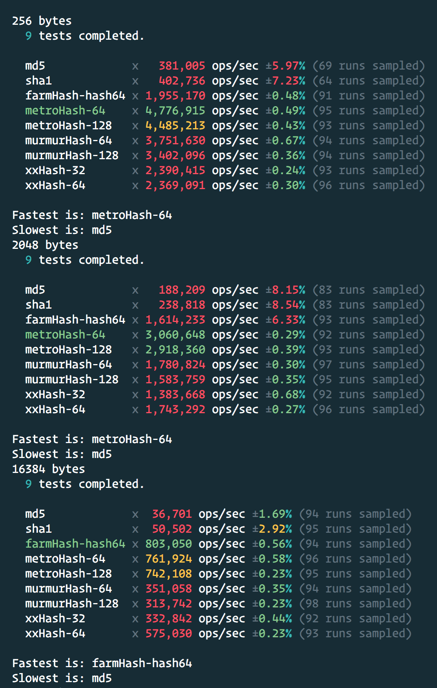

# Comparison of different hash algorithms

Based on the code from [this Medium post](https://medium.com/@drainingsun/in-search-of-a-good-node-js-hashing-algorithm-8052b6923a3b)

WASM Libs:

- `xxhash-wasm`: XXHash in WASM
- `hash-wasm`: Collection of algorithms

Well maintained native bindings:

- Farmhash (only native binding available)
- XXHash (pure JS and WASM implementations available)
- Murmurhash (no WASM/JS solution got any traction)

Excluded native bindings (not well maintained):

- Metrohash (not supported on ARM/M1)

## iMac 5K 2014 4Ghz i7

## MacBook Pro 2016 2.7 Ghz i7

