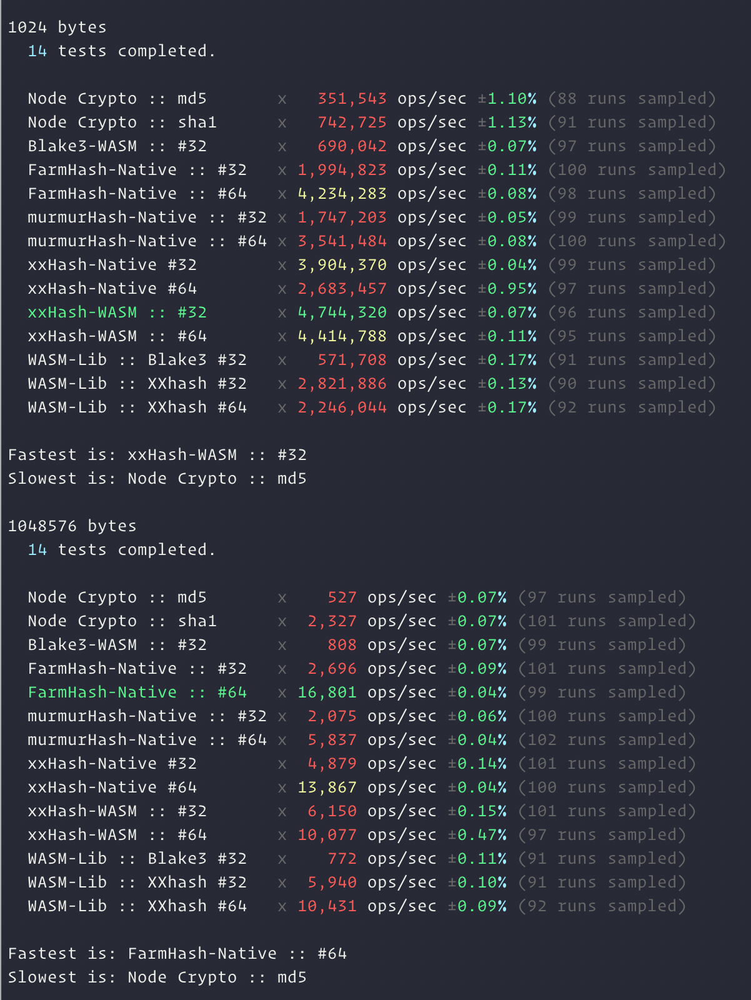

# Performance comparison of different hash algorithms

Based on the code from [this Medium post](https://medium.com/@drainingsun/in-search-of-a-good-node-js-hashing-algorithm-8052b6923a3b)

WASM Libs:

- `xxhash-wasm`: XXHash in WASM
- `hash-wasm`: Collection of algorithms

Well maintained native bindings:

- Farmhash (only native binding available)
- XXHash (pure JS and WASM implementations available)
- Murmurhash (no WASM/JS solution got any traction)

Excluded native bindings (not well maintained):

- Metrohash (not supported on ARM/M1)

## Results

### iMac 5K 2014 4Ghz i7 (X64)

### MacBook Pro 2021 M1 Pro (ARM)

## Summary

- Small files/content: [XXHash WASM](https://github.com/jungomi/xxhash-wasm) is the winner
- Big files/content: [Farmhash Native 64](https://github.com/lovell/farmhash) is the winner

What's nice is that XXHash WASM is so fast in most cases that going natively is only beneficial for quite large files. For most common hashing needs XXHash WASM looks like a easy to use and high performance cross-platform solution.
